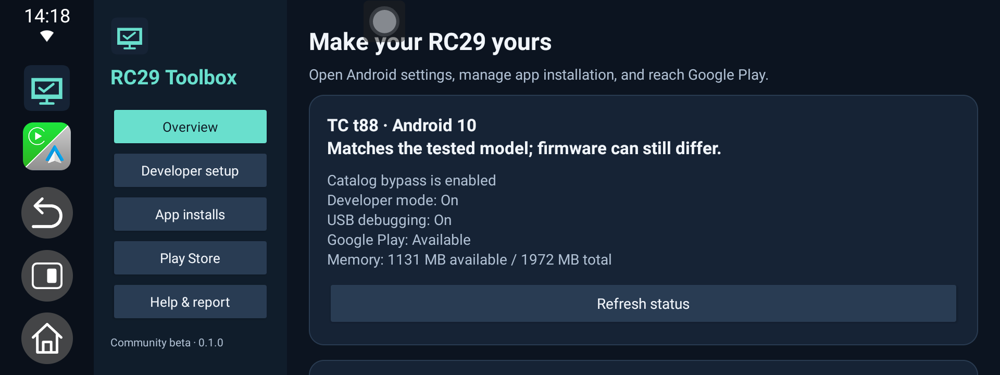

# RC29 Toolbox 0.1.0 beta

A small community Android app for LAMTTO RC29 / TC t88 owners. It brings the hidden Settings route, catalog controls, Google Play access, and a shareable device report into one interface. Java + XML; no third-party runtime dependencies, native libraries, ads, analytics, internet permission, root commands, or background services.

This is a community beta, not an official LAMTTO, Google, or SiriusXM product. The code is supplied for inspection and rebuilding. Redistribution permission for third-party apps or firmware is not implied; none is bundled here.



## Download

[Download the complete RC29 Toolbox beta ZIP](https://github.com/LTGRaven/rc29-toolbox/releases/download/v0.1.0-beta/RC29-Toolbox-0.1.0-beta.zip). Extract it before copying APKs onto a microSD card or USB drive. The release includes the standard APK, optional Starter APK, Windows helper, source archive, instructions, and test results. [View all release files](https://github.com/LTGRaven/rc29-toolbox/releases/tag/v0.1.0-beta).

The standard APK was installed and tested on the reference RC29. The newly signed Starter APK still needs confirmation on another catalog-locked unit. Read the edition and setup instructions below before installing.

## Start with the right APK

**RC29-Toolbox.apk** (`com.rc29.toolbox`) is the normal edition. Use it if APK installation already works or if USB debugging is already available.

**RC29-Toolbox-Starter.apk** (`com.sirius`) is an optional initial helper for catalog-locked units. On the tested device this package identity was already individually approved by the vendor. The starter has Toolbox's own code, label, icon, and signing key; it contains no SiriusXM code and does not use SiriusXM's signing certificate.

The starter's initial-install route depends on that package being preapproved on your firmware. It cannot update the genuine SiriusXM app or a differently signed older diagnostic helper. If Android reports a signature/version conflict, use the normal edition with the PC route; the installer does not remove existing apps or their data. Do not treat the starter as a SiriusXM update.

## Route A: start on the RC29

1. Copy the APK to a USB drive or SD card accessible to the RC29 and open it with Package Installer. Use the standard edition first if apps already install; use the optional starter if you are still catalog-locked and do not have a conflicting `com.sirius` installation.
2. Open Toolbox. The Overview reports your model and current setup status.
3. To enable Developer Options, open **Developer setup → Open Android Storage**. Tap the large used-storage number/title **eight times**. If a vendor password screen opens, press Back; on the tested firmware the developer flag is enabled before that screen opens. No password was needed.
4. In **App installs**, choose **Allow all app installs** and review the confirmation. Toolbox invokes the existing firmware property command as its own ordinary app user, then checks the result. This covers Google Play and sideloaded APKs.
5. In **Play Store**, open the already-installed store. The standard edition can add its own Play Store home-screen entry. Toolbox does not download Google Play, install Google services, create an account, or sign you in.
6. If you started with the starter, install the standard APK after enabling the bypass, open it, and remove the starter when no longer needed. They have separate package names. Add the Play Store shortcut from the standard edition so it remains when the starter is removed.

On the tested firmware direct catalog changes may work without enabling USB debugging first. The Storage guide and USB debugging remain useful when the PC fallback is needed. Opening Toolbox alone does not change the catalog or debugging settings.

## Route B: Windows helper

1. Enable USB debugging through the Storage/Developer Options route above, connect a data-capable USB cable, and accept your computer's authorization on the RC29.
2. Extract the entire release ZIP into a folder. Download Google's [Android Platform Tools](https://developer.android.com/tools/releases/platform-tools) if needed. Put the extracted `platform-tools` folder beside `Start-Windows.cmd`. The helper can also find Android Studio's default SDK installation or `adb.exe` on PATH.
3. Open **Start-Windows.cmd** and choose **Install/open standard Toolbox**. If needed, this grants an individual catalog exception to Toolbox only. It does not silently enable the master bypass.
4. Choose **Allow all app installs** in the app, or option 2 in the Windows helper. Option 3 restores the catalog restriction.

With several Android devices connected, the helper asks which one to use. It shows the device model and asks before changing an unverified model. Administrator privileges are not required. The launcher uses a process-local PowerShell execution-policy setting; it does not change Windows' saved execution policy.

For macOS/Linux or manual use, run these commands with Android Platform Tools and one authorized device connected:

```text
adb shell settings --user 0 put system com.rc29.toolbox 1
adb install -r RC29-Toolbox.apk
adb shell setprop persist.sys.tc.allow.third.install 1
adb shell getprop persist.sys.tc.allow.third.install
```

The final command should return `1`. Use `adb -s SERIAL` if several devices are connected. The manual examples assume Android user 0; the Windows helper detects the active user.

## Individual approvals and undo

Individual approvals require an authorized PC on the tested firmware. Use option 4 in the Windows helper, or enter a package name in Toolbox to display the matching manual command. Merely displaying a command makes no change.

The Windows helper displays the previous value before changing it. Save that value if you want to undo the approval. If it was `null`, use the displayed delete command; otherwise restore the saved value. An approval is for the package identity; it does not authenticate the developer or download/install that app.

## What the catalog control changes

The tested firmware checks `persist.sys.tc.allow.third.install` inside `PackageInstallerSession.assertApkConsistentLocked` in `services.jar`. When enabled, that vendor catalog check is skipped for all sources. Ordinary Android checks, Play Protect, device/app compatibility, storage requirements, and signature matching are not disabled by Toolbox.

To restore the restriction, use the app's **Restore catalog restriction** button or:

```text
adb shell setprop persist.sys.tc.allow.third.install 0
```

Existing apps and individual approvals remain. **Uninstalling Toolbox does not undo the property change.** This is a persistent property; reboot/update persistence has not been separately verified on every firmware.

## Supported/tested environment

- TC t88 / LAMTTO RC29, Android 10 / API 29.
- Firmware label: `T88-MIPI91-USER-20260727172621`.
- Fingerprint: `alps/Android/Android:10/QP1A.191105.004/826:user/dev-keys`.
- This unit's SELinux mode was already **Permissive**. Toolbox neither changes SELinux nor requests root. A device with an enforcing or differently configured policy may deny direct property changes; use the authorized PC fallback if supported.
- Both APKs use minSdk 21 and targetSdk 35. Supporting an Android API level does not establish firmware compatibility.
- Other manufacturers, RC29 revisions, and firmware releases require separate testing. The model indicator is not a firmware certification.

The ordinary user cannot usually write arbitrary system properties on standard Android. The direct route is specific to this firmware's permissions. See [Android's system-property access-control documentation](https://source.android.com/docs/core/architecture/configuration/add-system-properties).

## Privacy and permissions

The app requests no Android permissions. No permissions are needed for its catalog command attempt, Settings shortcuts, or Play Store entry on the tested device. It declares no internet, storage, accessibility, device-administrator, or settings permission. It has no remote-command interface: only the main Activity and optional Play Store launcher alias are exported.

Reports are generated locally, previewed, and shared only through the user's chosen share destination. Reports include build/model/setup information, not serial numbers, account names, Wi-Fi names, or full logs. The app does not export firmware/APKs.

## Send a device report

Open **Help & report → Preview device report → Copy** in Toolbox. [Open a device report](https://github.com/LTGRaven/rc29-toolbox/issues/new?template=device-report.md) and paste the report. Include your firmware label and what worked or failed. You can attach a photo of the report if copying from the RC29 is inconvenient.

Reports are not sent automatically. GitHub issues are public, so review pasted text and photos before submitting them. Do not include passwords, account details, or device serial numbers.

## Development

This project was developed with assistance from OpenAI's Codex. Codex helped inspect the device's firmware behavior, implement the Java/XML app and Windows helper, and verify the working installation controls on the owner's physical RC29. See `TEST-RESULTS.md` for the tested behavior and remaining limitations.

## Build and source

Use JDK 17 or newer and Android SDK 35. Open the source project in Android Studio, or run:

```text
gradlew.bat :app:assembleStandardDebug :app:assembleStarterDebug
```

On macOS/Linux use `sh gradlew`. Output APKs are under `app/build/outputs/apk/standard/debug/` and `starter/debug/`. The first build needs internet access for Gradle and Android build tools if they are not already installed/cached.

Release builds use environment variables `RC29_SIGNING_STORE` and `RC29_SIGNING_PASSWORD`, alias `rc29-toolbox`. The distributed release APKs are signed and non-debuggable. Private signing keys and passwords are deliberately excluded from the source and release ZIPs. A build signed with your own key cannot update the supplied APK in place.

See `TEST-RESULTS.md` for the concrete verification performed for this beta, and `SHA256SUMS.txt` in the release download for artifact hashes.
